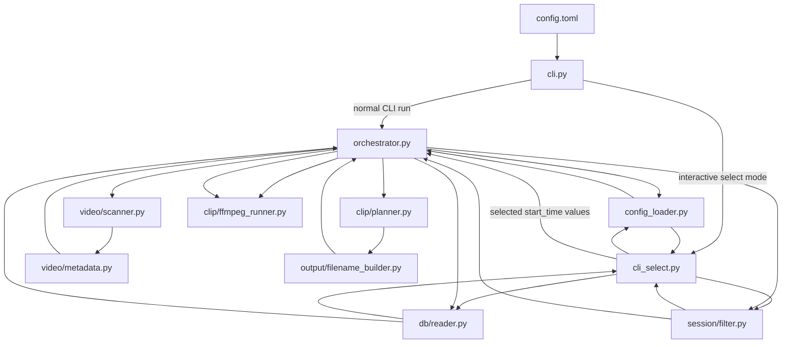

# Beat Saber Auto Clip Tool

Automatically extract Beat Saber clips from long recordings by matching Beat Saber play sessions to OBS footage using DataRecorder SQLite logs.

Designed for players who record full play sessions and want quick clip extraction.

## Demo


A demo recording will be added later.

## Features

- Automatic Beat Saber clip extraction from `MovieCutRecord` session data.
- Long recording support by matching each play session against the recording whose time range contains it.
- Interactive clip selection with a terminal picker for the most recent filtered sessions.
- Flexible filtering via `config.toml`, including cleared state, rank, score, song name, difficulty, and exact start times.
- `ffmpeg`-based clip export with configurable codecs, copy/reencode modes, and output naming.

## System Overview



`cli.py` is the main entrypoint. A normal run loads config and starts `orchestrator.py` directly. In `select` mode, `cli_select.py` loads the same config, reads and filters sessions, shows the most recent matches, and passes the chosen `start_time` values back into the orchestrator as a runtime filter override.

## Installation

Requirements:

- Python 3.12+
- `ffmpeg`
- `ffprobe`

Install with `uv`:

```bash
git clone git@github.com:nejiman10/beatsaber-autocut.git
cd beatsaber-autocut
uv sync
```

## Configuration

Create your local config from the example:

```bash
cp config.toml.example config.toml
```

Key sections:

- `paths`: locations for the Beat Saber database, source recordings, and clip output directory.
- `cut`: clip timing mode plus pre-roll, post-roll, and optional timestamp offset.
- `filter`: rules for narrowing sessions before planning or interactive selection.
- `organize`: optional subdirectory layout for exported clips.
- `select`: how many recent filtered sessions are shown in interactive mode.

## Usage

Run automatic export:

```bash
bs-autocut config.toml
```

Interactive selection:

```bash
bs-autocut config.toml select
```

In `select` mode, the tool:

1. Loads `config.toml`.
2. Reads sessions from the DataRecorder database.
3. Applies the configured filters.
4. Shows up to `select.recent_limit` matching sessions, newest first.
5. Prompts for comma-separated session numbers.
6. Runs the normal pipeline using only the selected `start_time` values.

Export specific sessions:

```bash
bs-autocut config.toml --start-time 1773667651978
```

You can repeat `--start-time` multiple times to export more than one exact session.

## Development

OpenAI Codex was used during development of this project.

Codex assisted with implementation, refactoring, and test scaffolding. The project author defined the requirements, made the architecture decisions, reviewed the results, and made all final decisions on the shipped code and documentation.

## Acknowledgements

This tool is built around the Beat Saber gameplay ecosystem and the workflows of players who record sessions for later review and clipping.

It relies on DataRecorder for the SQLite gameplay logs used to identify play sessions, and uses FFmpeg for clip cutting and encoding. Thanks to the developers and maintainers of Beat Saber, [DataRecorder](https://github.com/rynan4818/DataRecorder), and FFmpeg for the work that makes this tool possible.

## License

License information to be added.
